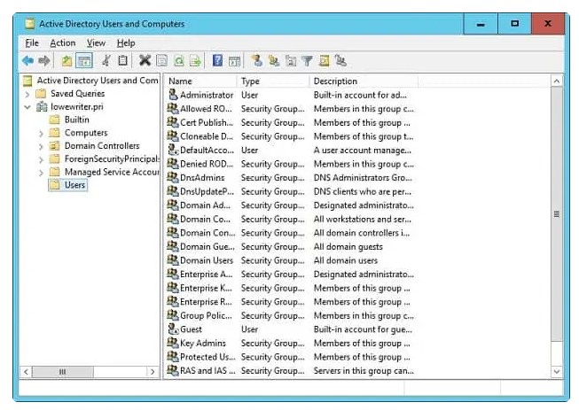
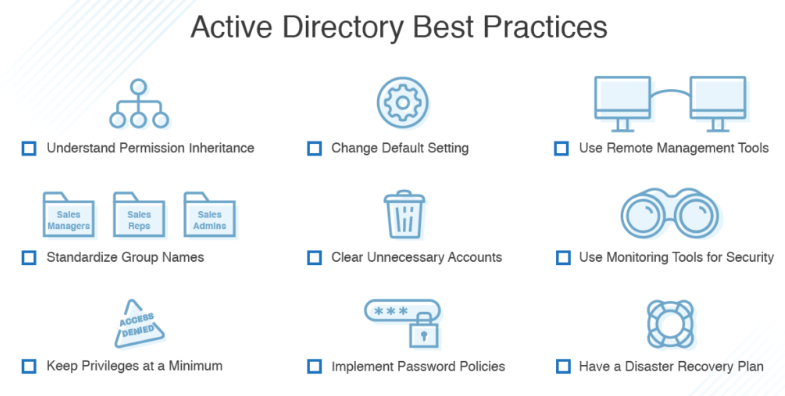

# Active directory

Active Directory (AD) on Microsoft:in Windows toimialueen käyttäjätietokanta ja hakemistopalvelu, joka hallitaan verkon käyttäjiä, tietokoneita ja eri resurssei. Myös mahdollistaa keskitetyihin resurssien jakamista käyttäjille, ryhmille ja sovelluksille, sekä tarjoo myös tavan nimeä, kuvata, paikallista, hallita ja suojaa verkon resurssia.

AD rakentuu nykyään LDAP (Lightweight Directory Access Protocol)- ja Kerberos-protokollille. Myös mukana on Microsoft pilvipohjainen Azure AD-palvelu, mitä tarjoaa kattavan <b> Identity and access management (IAM) </b> -  ratkaisua yritykselle/organisaatiolle, jotka haluavat hallita paikallisia ja pilvipohjaisia resurssia.

- 
- 
- [AD monipuolisia harjoituksia](#AD-monipuolisia-harjoituksia)
- 

##

# AD monipuolisia harjoituksia

active directory:ssä on jotakin hyviä harjoituksia, mitä voi tukea työpaikassa, koulutuksessa tai muualla käyttöön niin niistä voi olla hyötyä tulevaisuudessa

