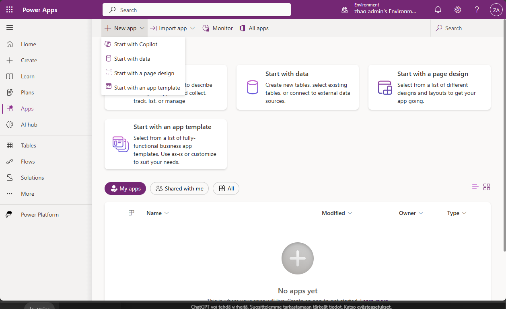

# Ensimmäinen Power Apps sovellus - heinäkuu 2025

Tämä on ensimminen power apps sovellus ja kirjauduin omalla admin tunnuksilla sisään, että kuinka tämä toimii ja harjoituksen kannalta kokeilin "start with copilot".

Tässä on muutama kuva, josta kuin kirjautuu ja aktivoi ensimmäisen kerran Power App:sin sovelluksen/työkalunsa.

  

  

  

  

---

# Seuraavaksi alettaan valita pohja

Tästä kannattaa kysyä tarvittaessa tekoälyltä **Microsoft copilot** tai yleis CHATGPT apua, koska jos ei tiedä mitä on tekemässä ja kannattaa tehdä vertailua - molemmilla on yhtä hyvät ohjeet ja neuvot, mutta riippuu kummasta tykkää ja luottaa.

## Aloitettaan "new apps"

New app listan alta:
- Start with Copilot (tekoälyavusteinen sovelluksen luonti)
- Start from Data (aloita valitsemalla tietolähde, esim. SharePoint, Excel)
- Start from a page design (rakennetaan valitusta sivusta)

  

