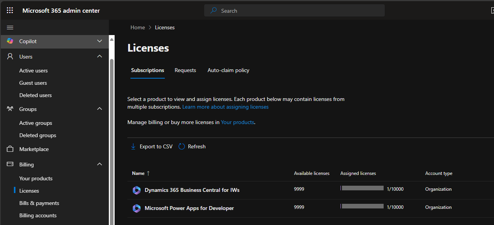

# Power Apps

Power Apps kuuluu Microsoftin ekosysteemiin, mutta se on osa Microsoft 365 -kokonaisuutta — erityisesti silloin, kun käytetään Power Appsia yhdessä SharePointin, Excelin, OneDriven tai Teamsin kanssa

# Microsoft / M365

🧩 Miten Power Apps liittyy M365-ryhmään?
Power Apps ei itsessään ole ryhmätyökalu kuten Outlook, Teams tai SharePoint-sivusto, mutta voit rakentaa sovelluksia, jotka hyödyntävät M365-ryhmän resursseja (esim. SharePoint-listat, OneDrive-tiedostot).

- Kun teet Power Apps -sovelluksen, voit liittää sen ryhmän SharePoint-listaan, jolloin sovellus toimii osana ryhmän työnkulkuja.
- Jos sovellus on tarkoitettu useille käyttäjille, se voi hyödyntää M365-ryhmää käyttäjäoikeuksien hallintaan.

Power Platform on laajempi osa Microsoftin ekosysteemiä, mutta se toimii tiiviisti M365:n kanssa — erityisesti tiedonkeruussa, automatisoinnissa ja mobiilisovellusten rakentamisessa.

---

# Power Apps Developer Plan — Mitä sillä voi tehdä?

1. Ilmainen henkilökohtainen kehitysympäristö  
- Saat käyttöön oman, erillisen Power Apps -ympäristön pilvessä.  
- Voit luoda ja testata sovelluksia ilman, että tarvitset maksullista lisenssiä tai tuotantoympäristöä.  
 

3. Sovellusten rakentaminen ja testaaminen  
- Voit rakentaa Canvas- ja Model-driven -tyyppisiä sovelluksia.  
- Käyttää Dataverse-tietokantaa (Microsoftin pilvipohjainen tietovarasto).  
- Testata sovelluksia ja niiden toimintoja kokonaan vapaasti.  
 

4. Oppiminen ja kokeilu  
- Sopii loistavasti, jos haluat opetella Power Apps -kehitystä.  
- Voit tehdä prototyyppejä ennen kuin otat käyttöön maksulliset lisenssit.  
- Voit kokeilla integraatioita eri Microsoft- ja ulkopuolisten palvelujen kanssa.  

 
5. Ei tuotantokäyttöön  
- Developer Plan on tarkoitettu vain kehitykseen ja testaukseen, ei oikeisiin bisneskäyttöihin.  
- Sovelluksia ei voi jakaa laajasti organisaatiossa tai ulkopuolisille käyttäjille.  
- Käytät sitä omissa kehitystarkoituksissasi.  

 
Mitä ei voi tehdä Developer Planilla?  
- Et voi julkaista sovelluksia tuotantokäyttöön tai jakaa niitä laajasti.  
- Et voi käyttää sovelluksia yrityksen virallisessa arjessa.  
- Et saa tukea tuotantokäytön SLAs:ää (Service Level Agreement) varten.  
- Käyttöoikeudet ja kapasiteetti ovat rajatut verrattuna maksullisiin lisensseihin.  

---

## Yleis kuvauksena

**Power Apps** on Microsoftin matalan koodin alusta, joka mahdollistaa sovellusten luomisen ilman perinteistä ohjelmointia. Sovellukset voivat käyttää tietolähteinään esimerkiksi SharePoint-listoja, Excel-tiedostoja, tai Dataverseä. Power Apps toimii saumattomasti Microsoft 365 -ympäristössä.

## 🔍 Power Apps vs SharePoint-sivusto

| Ominaisuus            | Power Apps                              | SharePoint-sivusto                         |
|------------------------|------------------------------------------|---------------------------------------------|
| Tarkoitus              | Sovellusten kehittäminen                | Sisällönhallinta ja yhteistyö              |
| Käyttötapa             | Mobiili- ja selainpohjainen sovellus     | Selainpohjainen verkkosivusto               |
| Räätälöinti            | Laaja visuaalinen muokattavuus           | Rajallisempi muokkaus                       |
| Tietolähteet           | Useita (esim. SharePoint, Excel, Dataverse) | Pääasiassa SharePointin listat/kirjastot |
| Loppukäyttäjäkokemus   | App-tyyppinen, voidaan näyttää omalta     | Verkkosivumainen käyttöliittymä             |

---

## 🧩 Power Apps & Microsoft 365 -ekosysteemi

| Alusta              | Sisältö                                       | Integrointi Power Appsilla                      |
|---------------------|-----------------------------------------------|-------------------------------------------------|
| Microsoft 365       | Outlook, Excel, Teams, SharePoint, OneDrive  | Sovellukset voivat hyödyntää M365-resursseja    |
| Power Platform      | Power Apps, Power Automate, Power BI         | Sovellusten ja automaatioiden rakentaminen      |
| M365-ryhmät         | Ryhmän SharePoint-listat, tiedostot          | Voidaan käyttää sovellusten taustadatana        |

---

## ⚙️ Toiminnallisuudet Power Appsilla

| Käyttötarve           | Tuki Power Appsissa                | Huomioitavaa                              |
|-----------------------|------------------------------------|--------------------------------------------|
| 📂 Tietokanta             | ✅ SharePoint, Excel, Dataverse     | Premium-yhdistimet vaativat lisenssin      |
| 📎 Liitteiden käsittely   | ✅ Voidaan ladata/tallentaa         | Esim. SharePointiin tai OneDriveen         |
| 💬 Viestien jättäminen    | ✅ Lomake-elementeillä              | Ei sisäänrakennettua chat-toimintoa        |
| 📍 GPS-sijainti           | ✅ Mobiililaitteilla                | Paikannus toimii Android/iOS               |
| 💳 Maksaminen             | ❌ Ei suoraan tuettu                | Vaatii ulkoisia palveluita & yhdistimiä    |
| 🎵 Mediasisältö (musiikki)| ⚠️ Rajoitettu                      | Vaatii monimutkaisempia ratkaisuja         |

---

# Power Apps - käytännössä lyhyesti tiivistettynä

## Käytännössä:
- Jos  haluaa opetella Power Apps -kehitystä, tehdä uusia sovellusideoita ja kokeilla miten eri liitännät toimivat, Developer Plan on erinomainen ja ilmainen työkalu siihen. 
- Jos haluat tehdä bisneskäyttöön sovelluksia, jotka työntekijät tai asiakkaat oikeasti käyttävät, tarvitset maksullisen lisenssin.

## Mihin tämä sopisi:
- Tämä Power Apps toimi kuin nopean kehityksen työkalupakki nykyaikaisten sovellusten luomiseen – ilman tarvetta kirjoittaa perinteistä koodia.
- Tämä toimii kuin nopea low-code-työkaluna - tarkoittaa kehitysympäristöä tai alustaa, jossa asovellus, sivusto ja/tai automaatiota voi rakentaa kehittäjän puolesta, mutta joskus tarvitaan pientä koodinpätkää jos haluaa tehdä jotakin räätälöityä ominaisuutta.

- Kehittyneemmät käyttäjät voivat käyttää Power Platform CLI:tä ja purkaa sovelluksen YAML/JSON-muotoon, mutta se ei ole sama kuin avoin lähdekoodi.

- Power Apps on tarkoitettu sisäisille (yrityksen organisaation) henkilölle kuten yksittäisen/tietyn tiimeille, osastoille tai projektiryhmille. Tätä Power Apps rakennettua projektia ei ole tarkoitettu julkaisuun esim. Tuotantoon ja tätä ei ole tarkoitettu koko organisaatioon "virallisiin" tai julkisiin julkaisuihin.
- Kehittäjälle esim. Lisäisi monimutkaisempaa logiikka, integraatiota, suunnittelijalle ja osa koodaajille.

## Käyttötarkoitus:
- Power Apps on tarkoitettu enemmän käyttöliittymän rakentamiseen (lomakkeet, painikkeet, galleriat, hakutoiminnat ja jne). Vähä kuin demoaisi jonkinlaisen sovelluksen pohjan, mutta sitä ei kannata käyttää tiedostojen tallentamiseen. 
- Jos tietojen tallentamista käyttää niin kannattaa mennä SharePoint. 
- Sama pätee tätä ei kannata rakentaa mitään verkkokauppan kaltaista sovellusta, koska sen maksamisen prosessi, skaalauttuvuutta ja suorituskyvykyyttä verkkokauppanmaailmaa.

## Samaan tuotannosta:
- Power Apps sovellukset ei ole takoitettu julkisiin palveluihin ja ei ole tarkoitettu tuotantoon käyttöön. 
- Jos tuotannosta aikoo mietiä, se on tarkoitettu kevyen, rajoitettu sisäiseen työkaluun ja sama pätee Azure (entra ID) tenant mukaan ja vain sisäisille organisaation käyttäjille ja nimetyt henkilöt.
- Tämä Power Apps ei korvaa täysmittaista sovellusta (HR, CRM- tai ERP järjestelmää).

---

# 🛡️ Power Apps: Tietoturva, arkkitehtuuri ja käyttöympäristö:

- Power Apps toimii Microsoftin pilvessä (SharePoint, Dataverse, OneDrive)
- GDPR-yhteensopiva kun käytetään oikein
- Ilmaisella lisenssillä voi käyttää sovelluksia SharePointin ja OneDriven kanssa
- Premium-toiminnot kuten SQL, Dataverse, maksuyhdistimet vaativat maksullisen lisenssin
- Sovellukset jaetaan käyttäjille Microsoft-tilin kautta – ei tarvitse asentaa erikseen

## Tietoturva ja tietosuoja osa - 1:
- Kesken eräisimmät on kuitenkin käsitellä henkilötietoja just lomakkeet ja sopimukset kuten HR tietoja. Kuitenkin Power Apps ei ole tarkoitettukaan julkiseen käyttöön, se silti soveltuu hyvin sisäisen tiedonhallintaan.
- Microsoft pilviympäristöstä aina pitää olla vahva suojaus:
  - TSL-salaus tiedonsiirto
  - Tietojen salauksen lepo (SQL TDE)
  - Käyttäjäoikeuksien hallinta (Entra ID, roolit, ryhmät ja lisenssit)
- Yleisen GDPR yhteensopivuus ja pätee ISO 27000 standardiinsa. GDPR osalta vaatii hallitun tallennuspaikat esim. SharePoint. 
- Tietojen sijainti ja hallinta, että pätee CIA - triad (luottamus, eheys ja saatavuus)
- Tietoja ja GDPR vaatimuksia on huomioitava kuitenkin aina tapauskohtaisesti.

## Tietoturva ja tietosuoja osa - 2:
- Power Apps sovelluksien osalta toimivat vain Microsoft pilvessä ja perustuviin Azure AD (Entra ID ) käyttäjähallintaan, että sovellusten käyttö voidaan rajata turvalisesti organisaation sisäisille käyttäjille.
- Sovelluksen osalta ei itsensään takaa tietoturvaa ja tietosuojaa - se riippuu mitä tietoa sovelluksesta aikoo käsitellä ja rakentaa, että missä data tallennettan esim. Just SharePoint.
- Kertauksena: Power Apps sovellus ei ole suunniteltu arkaluontoisen tai luottamuksellisen tiedon varsinaiseksi käsittelyalustaksi, vaan käyttöliittymäksi. Tallennus ja suojaus tulee aina ratkaista erikseen taustajärjestelmässä.

## 1. Ei omaa palvelinta tai backend-koodia

- Et tarvitse omaa Node.js-, TypeScript- tai muuta palvelinta → Microsoftin pilvipalvelu ylläpitää ja ajaa sovellusta.
- Ei tarvitse murehtia palvelimen päivityksistä, kapasiteetista, skaalauksesta tai haavoittuvuuksista, kuten:
 - Express.js:n tietoturvapäivitykset
 - NPM-pakettien CVE:t
 - HTTPS-sertifikaatit
- Toki tämä tuo hyvää turvallisuutta, mutta samalla rajoittaa hallintaa ja joustavuutta.

## 2. Power Apps toimii Microsoftin pilvessä (Azure)

- Kaikki Power Apps -sovellukset ajetaan Microsoftin infrastruktuurissa, omassa tenantissasi.
- Sovellukset sidotaan organisaation käyttäjiin Azure AD / Entra ID:n kautta.
- Pääsy sovellukseen on rajattu:
  - ✅ Organisaation käyttäjiin (oletuksena)
  - 🔒 Ei ole avoin internetiin, ellei tietoisesti ja teknisesti jaeta ulkopuolelle (edellyttää Power Pages tms.)

## 3. Tietoturva on pääosin hallittavissa Microsoft 365:n kautta

### ✅ Hyvät puolet:
- Autentikointi hoidetaan automaattisesti Azure AD:n avulla — ei tarvitse rakentaa omaa kirjautumislogiikkaa.
- Voit käyttää Microsoftin omaa Conditional Accessia, MFA:ta, roolipohjaisia käyttöoikeuksia.
- Voit rajata sovelluksia esim. vain tietyn ryhmän tai käyttäjän saataville.

### 🔒 Huomioitavaa:
- Et voi tehdä omaa "käsin tehtyä" autentikointia (kuten JWT-tokenin hallintaa, salasanakenttiä tai käyttäjän luontia).
- Olet sidottu Microsoftin tietoturva- ja pääsynhallintamalliin.
- Käytetyt tietolähteet (kuten SharePoint tai Dataverse) perivät pääsyn samoilla ehdoilla — jos käyttäjällä ei ole oikeuksia tietoon, ei Power Appsillakaan pääse siihen.

## 4. API:t ja ulkopuoliset yhteydet
- Power Appsissa voi käyttää valmiita liittimiä (connectors), esim. SharePoint, Excel, Outlook, SQL jne.
- Custom API-yhteydet mahdollisia, mutta niiden käyttö vaatii usein:
  - Premium-lisenssiä
  - API:n pitää olla turvallisesti julkaistu (HTTPS, autentikointi)
  - API:a ei voi käsitellä kovin matalalla tasolla (esim. HTTP-pyyntöjen yksityiskohtainen hallinta on rajallinen)

## 🎯 Mihin tämä sopii erityisesti?
- Intranetsovellukset, lomakkeet, raportointi, hyväksymisprosessit.
- Organisaation sisäiset työkalut, jotka eivät vaadi täydellistä räätälöintiä.
- Sovellukset, joissa tietoturva ja pääsynhallinta delegoidaan Microsoftin palveluille.

---

## 📲 Laitetuki

- **Selaimessa** (Chrome, Edge, Safari jne.)
- **Mobiilissa** (Android & iOS Power Apps -sovelluksella)
- **Tableteilla ja tietokoneilla**

Power Apps -sovellukset ovat responsiivisia ja toimivat kaikilla päätelaitteilla (puhelin, tabletti, tietokone), riippumatta käyttöjärjestelmästä tai merkistä – kunhan käytössä on Power Apps -sovellus tai selain.

Power Apps sovelluksen projekteissa voi testata erillaisia esim. tabletti, puhelin tai jopa tietokonen (Win & Apple Mac) koneiden näyttöjen koon resolluution mukaan. Esim. tukevat sitä kokoa, mutta useimmin ne on automaattisesti 

---

# Power Apps - huonoja puolia - START HERE;

## ❌ 1. Ei pääsyä varsinaiseen koodiin
- Et voi käyttää HTML:ää, JavaScriptiä, Node.js:ää tai TypeScriptiä.
- Kehittäjä ei pääse katsomaan tai muokkaamaan taustalla olevaa sovellusrakennetta.

(Tämä tarkoittaa vaikka exporttaisi tiedoston työaseman alle ja editoi VSCode/NotePad tai muu koodaus ohjelman alla - se ei onnistu. Koska tämä Power Apps toimii vain Microsoft omansa ohjelman ja sillä tallennus tyypin mukaan).

## ❌ 2. Rajoittunut muokattavuus
- Vain Power FX -kaavakieli käytössä.
- Ei täyttä kontrollia UI-komponenteista tai logiikasta.
- Monimutkaiset prosessit muuttuvat nopeasti vaikeasti hallittaviksi.

(Tämä tarkoittaa käyttäen Power Apps sitä tiettyä sovellusta, josta sieltä kautta rakentaa esim. yksittäisen koodin - mm. nappi - button tervehdys.)

## ❌ 3. Ei sovellu julkiseen tuotantokäyttöön
- Sovelluksia ei voi jakaa anonyymille käyttäjälle ilman Power Pages -ratkaisuja.
- Skaalautuvuus ja suorituskyky eivät riitä suuren käyttäjävolyymin tuotantojärjestelmiin.

## ❌ 4. Lisensointi voi tulla kalliiksi
- Maksulliset lisenssit (Per App / Per User) vaaditaan liiketoimintakäytössä.
- Dataverse, API-kutsut ja osa liittimistä vaativat lisämaksuja.

| Malli                | Hinta                                  | Käyttötarkoitus                                     |
|----------------------|----------------------------------------|-----------------------------------------------------|
| **Developer Plan**   | Ilmainen                               | Kehitykseen, testaukseen ja oppimiseen henkilökohtaisesti |
| **Per App Plan**     | ~5 USD/kk per käyttäjä per sovellus    | Pienille projekteille, yksittäinen sovellus         |
| **Per User Plan**    | ~20 USD/kk per käyttäjä                 | Rajaton käyttö useissa Power Apps -sovelluksissa    |
| **Pay‑As‑You‑Go**    | ~10 USD/kk per aktiivinen käyttäjä/sovellus | Dynaaminen hinnoittelu, perustuu todelliseen käyttöön |

Tästä koskien Entra ID (jos on ilmais versio) on mahdollista integroida Power Apps + Entra ID (enterprise application tai app registration) kanssa. Huomioina, että molemmissa jos sovellus ei jaeta muille käyttäjille - on mahdollista testata/integroida SharePoint:ia, mutta sharepointiin vaattii toinen lisenssi. - Tämä koskee yrityksien tai harrastelijoiden budjetointia, että onko tarvetta ja tarvitseeko esim. sitä lisessointia joko **P1/P2:lle**. P1 ja P2 lisessoinnissa vaadittaan ja avautuu muita konfigurointi asetuksia esim. conditional access , identity governance , App proxy ja jne, mitä Entra ID:n asetuksista löytyy. **(Ajalta ja haettu/kyselty tekoälyltä apua heinäkuu 2025)**

## Lisesointia koskien lisätietoa:

**Developer Plan** - on täysin ilmainen ja sillä ei ole 30 päivän kokeilua verrattuna muilla ja osalla Microsoft työkalujen/ohjelmien kanssa esim. Dynamic 365 sillä on 30 päivän kokeilu. Kuitenkin tällä Power Apps **Developer Plan** suunnitelman lisenssillä on nimenomaan tarkoitettu kehittäjälle, jotka haluavat kehittää/oppia ja kokeilla Power Apps:iä, että ilman aikarajaa ja tämä lisenssi ei vanhene automaattisesti 30 päivän jälkeen.

 
(Tässä esim. yleisen admin centeristä voi tarkistellaa lisenssit (*https://admin.microsoft.com*) ja global admin tai tietty admin tasoinen oikeus).

  

## 🔗 Lisätiedot ja huomioitavaa
- **Developer Plan** ei ole sallittu liiketoimintakäytössä tai muiden käyttäjien käytettäväksi. Tätä on mahdollista avata ja käyttääki esim. jos on käytössä Entra ID (Azure AD):ssa se ilmais lisenssi versio ja aktivoimalla tämän Power Apps sovelluksensa niin saa sen 1000 kpl ilmais lisenssin.
- **Standard-liittimet** (SharePoint, Outlook, OneDrive) sisältyvät Microsoft 365 -lisenssiin.
- **Premium-liittimet** (Dataverse, SQL, Custom Connector) edellyttävät maksullista lisenssiä.
- **Dataverse** vaatii aina premium-lisenssin, paitsi Teams-ympäristössä (rajatusti).

Developer plan kuitenkin voi teststa ja rakentaa integraatioa, mutta siinä on rajoitusta:  
- Ei voida jakaa sovellusta muille käyttäjille tai käyttää sitä liiketoimintakäytössä (tuotannossa)
- Ei saa käyttää esim. HR järjestelmänä oikeassa työelämässä ja ei kannatta tallentaa mitään koskien sopimusta, koodia ja ei voida muokata ja tarkistaa sitä koodia.![image

## ❌ 5. Tietojen tallennus ulkoistettu
- Power Apps ei itse säilytä tietoa, vaan tarvitsee erillisen tietolähteen:
  - SharePoint, SQL, Dataverse, jne.
- Tämä lisää arkkitehtuurin monimutkaisuutta.

## ❌ 6. Vikasietoisuus ja virheenkäsittely rajoittunutta
- Ei tukea kunnolliselle virheenkäsittelylle (esim. try-catch).
- Sovelluksen virhetilanteet voivat jäädä epäselviksi.

## ❌ 7. Responsiivisuus ei täydellinen
- Sovellus ei aina skaalaudu automaattisesti eri laitteille.
- Vaatii erikseen suunnittelua mobiili- ja tablet-näkymille.

## ❌ 8. Sovellusten hallinta ei kehittäjäystävällistä
- CI/CD-prosessit (DevOps) vaativat erikoisosaamista ja erilliset työkalut.
- Sovellusten siirto eri ympäristöjen välillä ei ole saumaton.

