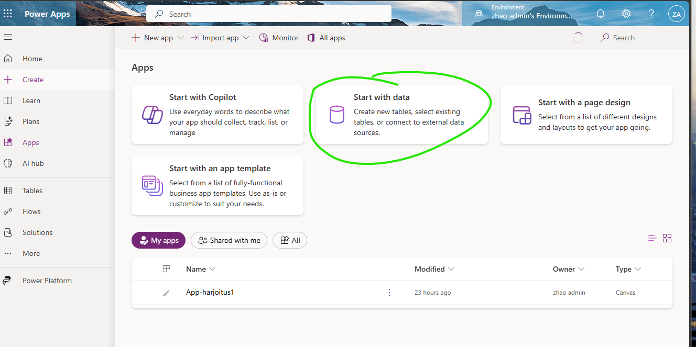
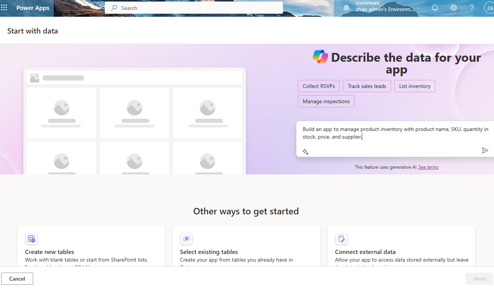
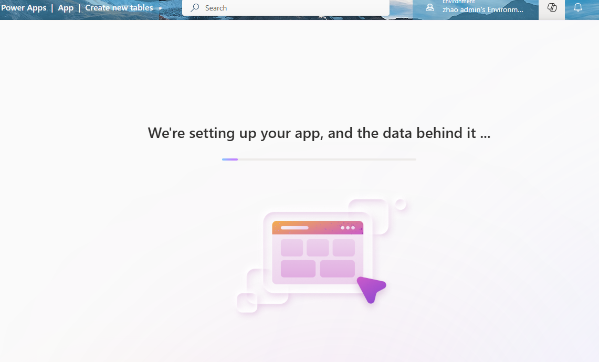
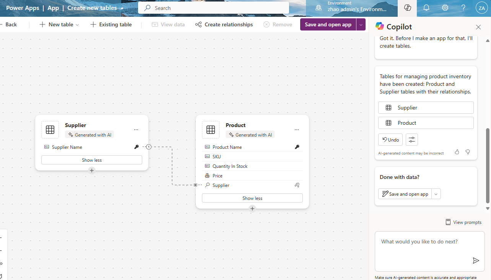
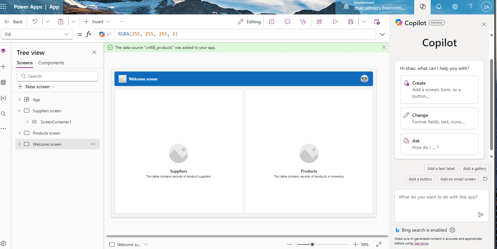
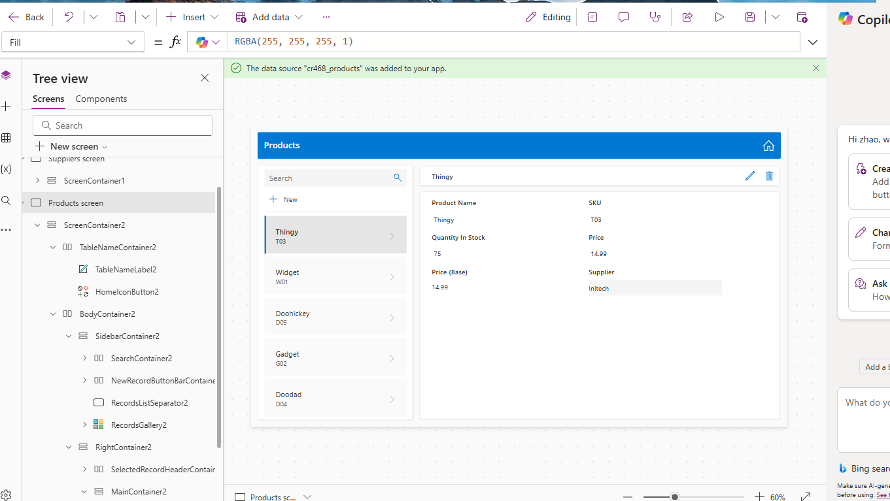

# Toinen apps - data versio - sovellus pohja - START HERE;

Rakensin uuden Power Apps -sovelluksen, joka perustuu data-pohjaiseen arkkitehtuuriin. Tämä tarkoittaa, että sovellus käsittelee ja hyödyntää tietoja, kuten:

 
📍 Sijaintitiedot  
👤 Käyttäjätiedot  
📦 Tuotetiedot  
🔄 Muu liiketoimintaan liittyvä metadata   

Tärkeä huomio: Power Apps ei ole tarkoitettu arkaluontoisten tai luottamuksellisten tietojen, kuten seuraavien, tallentamiseen:  
🔐 Salassa pidettävät asiakirjat (esim. PDF, Word)  
🧾 Sopimukset tai henkilötiedot  
🧑‍💻 Koodit tai muut sensitiiviset tiedostot
  

Sovellus toimii parhaiten, kun sitä käytetään dynaamisen ja ei-luottamuksellisen datan hallintaan ja visualisointiin. Tietoturvan ja tietosuojan varmistamiseksi suosittelen säilyttämään arkaluontoiset tiedot erillisissä, suojatuissa järjestelmissä.

Laitoin tuohon kenttään vaan tällaisen esimerkin:  
"Build an app to manage product inventory with product name, SKU, quantity in stock, price, and supplier.  

Kokeillaan "save and open app"  

---

## Onko tämä dataa, jonka luotiin?

Vastaus on kyllä, koska tässä sovelluksen alla on product ja supplier taulukkoja mukana. **Tämä on aitoa dataa, vaikka luotu automaattisesti Copilotin avulla ja tästä kuvasta näkee miksi se on dataa**.

---

## 🧠 Jotakin pohdinta asiansa – START HERE

### 🏪 Onko Power Apps hyvä esim. tuotetiedon säilytykseen tai verkkokauppaan?

✅ Sopii hyvin:
- Pienten sisäisten sovellusten tekemiseen, kuten:
  - Tuotetiedon ylläpito
  - Varastonhallinta
  - Tuoteluettelo (luettava tai muokattava sisäisesti)
  - Yksinkertainen sisäinen "tilauspyyntö"-järjestelmä  
➡️ Hyvä pienimuotoiseen sisäiseen käyttöön, ei vaadi omaa palvelinta tai koodausta.

❌ Ei sovellu hyvin:
- Julkiseen verkkokauppaan (esim. asiakkaille näkyvä tuotekatalogi, ostoskori, maksaminen)
- Käyttöön, jossa vaaditaan:
  - Ulkoisia käyttäjiä (asiakkaat)
  - Maksutapahtumia (kuten Stripe, PayPal)
  - Skaalautuvuutta sadoille tai tuhansille käyttäjille
  - Nopea suorituskyky verkkokauppamaailmassa

---

### 🛒 Voiko Power Apps tehdä tilaustoiminnon?

🔸 Kyllä, mutta rajoitetusti ja sisäisesti:
- Voit rakentaa esim. lomakkeen, jossa valitaan tuotteita ja lähetetään tilaus (sisäisesti)
- Tilaukset voidaan tallentaa SharePoint-listaan tai Dataverse-tauluun
- Voit lisätä Power Automate -automaatioita, kuten:
  - Lähetä vahvistussähköposti
  - Päivitä varastosaldo
  - Luo PDF-tilausyhteenveto  
💡 Esim. sisäinen varastotilaus tai huoltopyyntöjärjestelmä → onnistuu mainiosti Power Appsilla

---

### 🧱 Jos haluat oikean verkkokaupan?

| Tarve                             | Suositus                                                                 |
|----------------------------------|--------------------------------------------------------------------------|
| Julkinen verkkokauppa (asiakkaille) | ❌ Ei Power Apps → käytä esim. Shopify, WooCommerce, tai Power Pages + API |
| Sisäinen tilaussovellus          | ✅ Power Apps toimii hyvin                                               |
| Tuotetiedon ylläpito             | ✅ Power Apps + SharePoint/Dataverse                                    |
| Maksaminen ja asiakastilit       | ❌ Ei tuettua Power Appsissa natiivisti                                 |

🔐 Yksi iso rajoite:  
Power Apps ei tue anonyymejä eikä julkisia käyttäjiä ilman lisenssiä.  
→ Kaikkien käyttäjien tulee olla Azure AD / Entra ID -käyttäjiä, eli organisaation sisällä.

