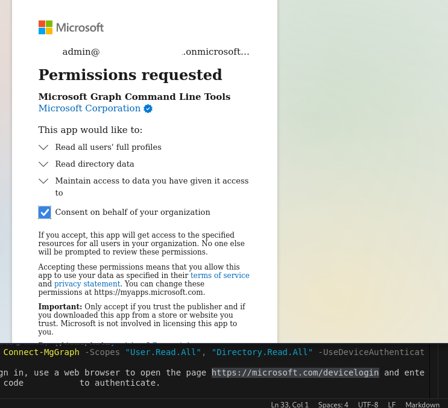
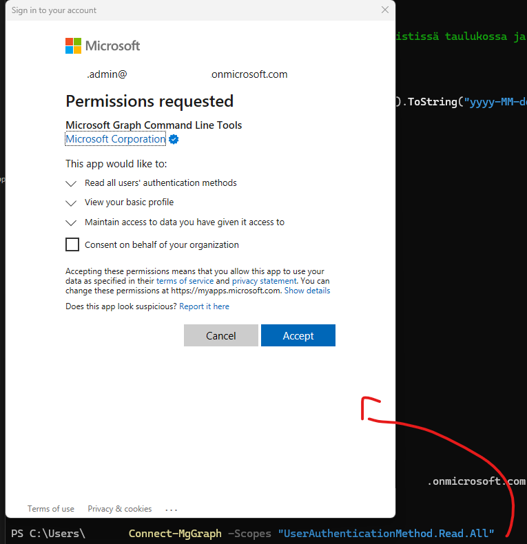
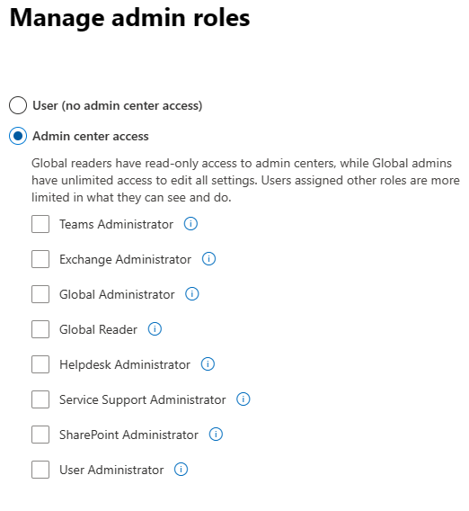
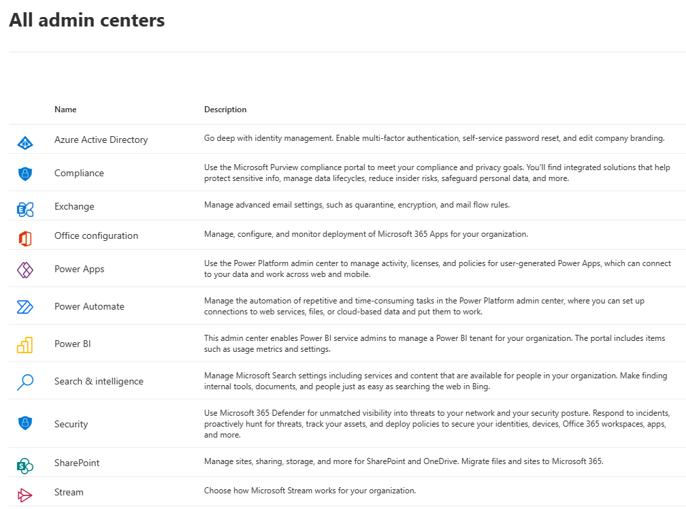
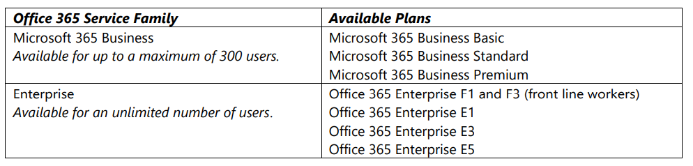
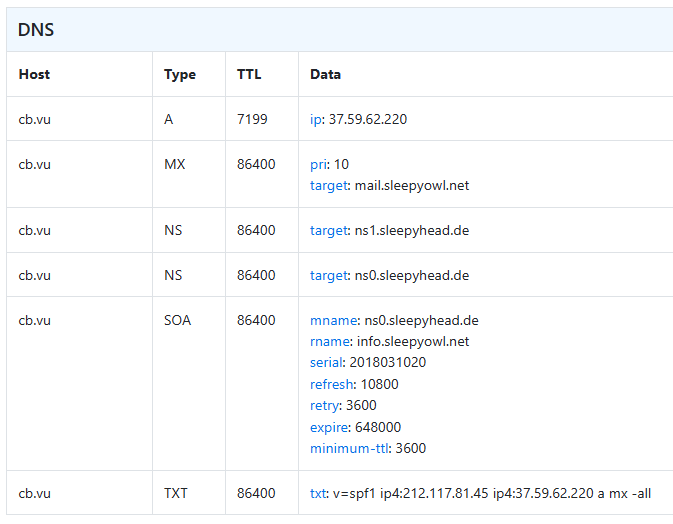

# UPDATE 

Nykyään alkaen maaliskuu 2024 eteenpäin PowerShell kautta jos haluaa yhdistää/kirjautua Microsoft pilvipalveluun eli omaan organisaatio Azure AD (nyky nimellä Entra ID) niin pitää ladata Microsoft Graph moduuli. 
- AzureAD (AD - active directory) nyky menee nimellä **Entra ID** (alkaen heinäkuu 2023) - joka on pilvipohjainen identiteetin ja pääsynhallintapalvelu, joka tarjoaa ratkaisuja käyttäjien ja sovellusten suojaamiseen. 

Ennen 2024, käytettiin **azuread** moduulia PowerShell:issä, jotta pääsee kirjautua entra ID (azuread). Normaalisti tähän pitää fyysisen työasemaan ladata tämä azuread paketti. AzureAD ja MSOnline-moduulit on deprekoitu (vanhentunut/poistui käytöstä).
- Nyt vain `Connect-AzureAD` on vanhentunut ja korvattu `Connect-MgGraph`-komennolla Microsoft Graph PowerShell SDK:ssa. Vanha AzureAD-moduuli on poistettu tuesta 2024 alkaen.
- Normaalisti Microsoft Graph (lyh. MS Graph) toimii periaatteessa sama ideana kuin aikaisempi AzureAD - mutta nimi on vain muutettu ja moduulissa saa käyttöön koko Graph API:n laajuuden eli se ei rajoitu vain Microsoft Entra ID-asioihin. Vaikka enitsen Azure AD ikään kuin Gaprh:in selkäranka autentikoitni varten. Graphin kautta sisälty muutakin toimintoja kuten:
  - Entra ID: käyttäjät, ryhmät, roolit, sign-in lokit…
  - Entra ID: app registration, enterprise application &...
  - Intune: laitteet, sovellukset, käytäntöprofiilit, compliance-tilat…
  - Purview: auditointi, DLP-politiikat, tiedonhallinta (rajoitetusti, osa toiminnoista vaatii erillisiä oikeuksia)
  - Defender-suojauspalvelut: esim. Defender for Endpoint -hälytykset ja ilmoitukset (osa saatavilla Graphin kautta)
  - Outlook, Teams, OneDrive, SharePoint: viestit, kokoukset, tiedostot, kalenterit jne.

## lataus steppi:

Tässä on lyhyesti miten se lataus ohje meni. Fyysisen työasemaan (windows), avaa *Windows powershell* (run as admin) - niin siinä ponnahtaa harmaa ikkuna, josta salli tekemät muutokset. 

💡 Huomio: Ennen kuin asentaa **Microsoft Graph PowerShell** -moduulin koneelle, kokeile komentoa `Connect-MgGraph` 
🔍 Jos saa virheilmoituksen "komentoa ei tunnistettu", moduuli ei ole asennettu tai ladattu — ja skripti ei toimi ennen sitä.

```
S C:\WINDOWS\system32> Import-Module Microsoft.Graph.Authentication -Force
Import-Module : File C:\Users\User\OneDrive\Asiakirjat\WindowsPowerShell\Modules\Microsoft.Graph.Authentication\2.28.0
\Microsoft.Graph.Authentication.psm1 cannot be loaded because running scripts is disabled on this system. For more
information, see about_Execution_Policies at https:/go.microsoft.com/fwlink/?LinkID=135170.
At line:1 char:1
+ Import-Module Microsoft.Graph.Authentication -Force
+ ~~~~~~~~~~~~~~~~~~~~~~~~~~~~~~~~~~~~~~~~~~~~~~~~~~~
    + CategoryInfo          : SecurityError: (:) [Import-Module], PSSecurityException
    + FullyQualifiedErrorId : UnauthorizedAccess,Microsoft.PowerShell.Commands.ImportModuleCommand
PS C:\WINDOWS\system32> Set-ExecutionPolicy RemoteSigned -Scope CurrentUser -Force
PS C:\WINDOWS\system32> Import-Module Microsoft.Graph.Authentication -Force
PS C:\WINDOWS\system32> Connect-MgGraph -Scopes "User.Read"
Connect-MgGraph : An error occurred when writing to a listener.
At line:1 char:1
+ Connect-MgGraph -Scopes "User.Read"
+ ~~~~~~~~~~~~~~~~~~~~~~~~~~~~~~~~~~~
    + CategoryInfo          : NotSpecified: (:) [Connect-MgGraph], EventSourceException
    + FullyQualifiedErrorId : Microsoft.Graph.PowerShell.Authentication.Cmdlets.ConnectMgGraph

PS C:\WINDOWS\system32> Connect-MgGraph -Scopes "User.Read"
Welcome to Microsoft Graph!

Connected via delegated access using 14d82eec-204b-4c2f-b7e8-296a70dab67e
Readme: https://aka.ms/graph/sdk/powershell
SDK Docs: https://aka.ms/graph/sdk/powershell/docs
API Docs: https://aka.ms/graph/docs

NOTE: You can use the -NoWelcome parameter to suppress this message.

PS C:\WINDOWS\system32> Get-ExecutionPolicy -List

        Scope ExecutionPolicy
        ----- ---------------
MachinePolicy       Undefined
   UserPolicy       Undefined
      Process       Undefined
  CurrentUser    RemoteSigned
 LocalMachine       Undefined


PS C:\WINDOWS\system32> Get-MgUser

DisplayName       Id                                   Mail                                          UserPrincipalName
-----------       --                                   ----                                          -----------------
Admin Company     ABC123-ABC123-ABC123-ABC123456789ABC                                               admin@companyName...
```

Jossakin tilanteessa jos kirjautuu myöhemmin uudestaan `connect-MgGraph` - MgGraph voi kirjoittaa myös pienellä (mggraph) - se tunnistaa sen tekstin/sanansa. Niin voi tulla automaattinen "Tervetuloa Microsoft Graph" - englanniksi. Tämä tarkoittaa se istunto on yhä tallella ja tallentanut muistiinsa. Jos halutaan **kirjautua ulos sessiosta**, niin täyttyy antaa komento, joka ikään kuin **katkaisee / kirjautuu ulos yhteydestä** Graph (Microsoft) palveluun `Disconnect-MgGraph` . 

Tämä komento sulkee yhteyden Microsoft Graphiin ja poistaa nykyisen todennustiedon PowerShell-istunnosta. Tämä pätee kirjautumista toisella tunnuksella ja testata eri käyttöoikeutta ja/tai sovellustunnusta.

Joskus voi olla hyvä myös tyhjentää `TokenCache`, jos kirjautumiset menevät oudosti välimuistin kautta. Tämän voi tehdä esim. sulkemalla PowerShell-ikkunan tai käyttämällä MSAL-kirjastoja tarkemmin.

Seuraavaksi nämä ovat yleisiä komentoja kirjauduttua PowerShell yhdistyneet Microsoft pilvipalveluun, joka ideana on kuin tehdä tarkistus: <br>

Tämä komento liittyy icrosoft Graph PowerShell -moduuliin, ja sen tarkoitus on näyttää nykyisen istunnon kontekstitiedot. Tämä tulostaa tiedot nykyisestä Microsoft Graph -istunnosta, mikä on hyödyllistä esimerkiksi skriptien vianmäärityksessä tai varmistaaksesi, että olet kirjautunut oikealla identiteetillä ja käyttöoikeuksilla.
```
PS C:\WINDOWS\system32> Get-MgContext

ClientId               : aT7pL$2jVqZ9#rB8-XXXXXXXXXXXX
TenantId               : zR8wE^4k1uKXXXXXXXXXXXX-XXXXXXXXXXXX
Scopes                 : {Application.Read.All, Application.ReadWrite.All, AppRoleAssignment.ReadWrite.All,
                         AuditLog.Read.All...}
AuthType               : Delegated
TokenCredentialType    : InteractiveBrowser
CertificateThumbprint  :
CertificateSubjectName :
SendCertificateChain   : False
Account                : jackjack.admin@domain.onmicrosoft.com
AppName                : Microsoft Graph Command Line Tools
ContextScope           : CurrentUser
Certificate            :
PSHostVersion          : 5.1.123456.1234
ManagedIdentityId      :
ClientSecret           :
Environment            : Global
```


Tämä tarkistaa oman käyttöoikeudet. Huomioi, että tämä koskee juuri sillä hetkellä kirjautunutta tunnusta ja vain, jos istunto jatkuu ilman uloskirjautumista. `(Get-MgContext).Scopes` palauttaa ne käyttöoikeudet eli "scopet", joihin kulloinkin kirjautunut tunnus on antanut suostumuksen kyseisessä istunnossa Microsoft Graphin kanssa. Ne kuvaavat, mitä kyseinen tunnus saa Graph-rajapinnan kautta tehdä ja mihin tietoihin se saa päästä.

```
PS C:\WINDOWS\system32> (Get-MgContext).Scopes
Application.Read.All
Application.ReadWrite.All
AppRoleAssignment.ReadWrite.All
AuditLog.Read.All
Calendars.ReadWrite
Directory.Read.All
Group.Read.All
Group.ReadWrite.All
Mail.Send
openid
Organization.Read.All
Policy.Read.All
profile
RoleManagement.ReadWrite.Directory
User.Read
User.Read.All
User.ReadBasic.All
email
```

**Huomioina** koskien kirjauttumista PowerShell MS graph moduulilla tonne omaan tenant ympäristöön, jossakin tilanteessa saattaa kysyä _oikeuden pyyntöä_, koska saattaa olla ensimmäinen kerta käyttö vaikka ei ole kirjauttunut aikaisemmin sillä työaseman istunnolla esim. uusi työasema tai uusi käyttöjärjestelmä vaikappa kirjaudttu virtualmachine laiteella. Vaikka oikeudesta esim. Entra ID:ssä on **global admin** tämä silti tulee kysellee ja onko tarvetta, on hyvä myös hyväksyä ja ylemmän komennosta voi toistaa PowerShell terminaalissa esim. tarkistaa oman API permisson oikeudet






---

# Microsoft 365
Office 365 (kait tunnetaan parhaiten Word, excel, power point ja jne)








## dns domain malli


