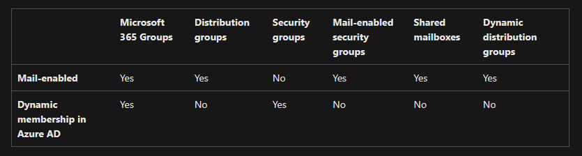
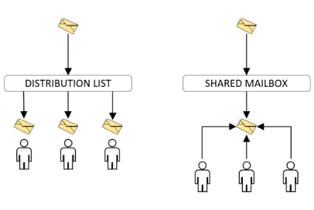

# M365 sähköposti asetukset

- [Distribution list vs shared mailbox & shared inboxes ](#distribution-list-vs-shared-mailbox--shared-inboxes)
    * [Jakelulista (Distribution list);](#jakelulista-distribution-list)
    * [shared mailboxes](#shared-mailboxes)
    * [dynaaminen jakelulista (Dynamic distribution);](#dynaaminen-jakelulista-dynamic-distribution)

- [powershell määritykset](#powershell-määritykset)
- [linkkit & muita ohjeita;](#linkkit--muita-ohjeita)
- [powershell](#powershell)
    * [powershell login to microsoft ](#powershell-login-to-microsoft)
    * [muita kivoja komentoja](#muita-kivoja-komentoja)
    
- [muita asetuksia (exchange admin center)](#muita-asetuksia-exchange-admin-center)
    * [forwarding email](#forwarding-email)

- [linkkit & muita ohjeita;](#linkkit--muita-ohjeita)
    * [powershell ohjeita](#powershell-ohjeita)



# Distribution list vs shared mailbox & shared inboxes 

- Distribution list (jakelulista): Luettelo sähköpostin vastaanottajista, jotka on osoitettu yhdeksi vastaanottajaksi. 
- Shared mailboxes: yhden tai useamman henkilön kanssa jaettu postilaatikko. 
- Shared inboxes (ohjelmistoratkaisu): Yhteistyötyökalu, jonka avulla tiimit voivat vastata sähköposteihin yhdessä.



## Jakelulista (Distribution list);

perus ylläpitävien luettelon spostin vastaanottamista ja osoitettu yhdeksi vastaanottajaksi. 

Lista tukee koko tiimin, esim käsittelee asiakastukea, henkilöstöä.  

Toiminnaltaan: kun lähettää spostiviestin jakelulistan osoitteeseen niin viesti kopioidaan ja toimitetaan useisiin postilaatikoihin jakelulistalle määritettyihin vastaanottajien henkilöstkohtaisiin sposti osoitteisiin, joista kukin saa kopion spostin. Tiimin jäsen vastaa jakelulistan kautta saatun spostin, vastaus lähetetään hänen henkilökohtaisee spostin osoitteeseen. 

- Esim. tiimi@domain.fi <----> matti.meikalainen@hallinta.fi & periaatteessa tiimistä pitää yksittäinen henkilö ottaa vastaan, että pitää keskustella matti meikäläisen kanssa.  
- Spostista ei voida lähettää jakelulistasta osoitteseen, kun jakeluluettelon kautta vastaanotettu sposti poistettaan, se poistaminen vain tpaahtuu toiminnon suorittaneen henkilön spostista. 

- <b> Hyödyt: </b> jotka on tehty yksisuuntaiseen viestintään, minkä ne toimivat yrityksen ilmoitusten tai tietojen jakamista ja eivät toimi viestintäkanavien asiakkaiden kanssa. 

- <b> Riskit: </b> käyttö voi olla monimutkaista, mutta sekavien postilaattikoiden kannalta  jäsenet saavat kopion jokaisesta viestistä, että se aiheuttaa sekasotkua saapuvista sähköpostilaatikosta ja tehottomuutta. Kopio tarkoittaa, että kaikki tiimin jäsenet käyttävät aikaa samoja spostien kirjoittamista ja lajitteluun.  

Muita ongelmia voi johtaa vastuullisuutta, näkyvyyttä ja yhteistä työn puutetta. Myös seurauksena monen asiakkaiden palvelutiimien voivat korvata jakelulistan sposti pohjaisiin jaettuihin postilaatikkoihin tai jaetuilla posti laatikkon hallinnan yrityksen viestintään. 

<hr>

## dynaaminen jakelulista (Dynamic distribution);

Dynaaminen jakeluryhmä on sähköpostien ryhmiä, jolloin käytettään sähköpostia lähettämisen ihmisille/asiakkuuksille/käyttäjille, jollloin on tietyt ominaisuudet, kuten osasto tai sijainti niin tätä määritettään <b>Exchange admin center:in</b> azure:ad sijainnissa. 

Eri kuin tavalisen <ins>jakelulista</ins>ryhmä, jotka sisältävät määritettyä jäsenien/käyttäjien joukkoa, dynaamisen jakeluryhmissä jäsenluettelo lasketaan aina, kun ryhmille lähetetään viestin, määrittämisen suodattimisessa ja ehdon perusteella. Kun sähköpostiviesti lähetetään dynaamisen jakeluryhmissä, se toimitetaan kaikille organiaaation vastaanottajille, jotka vastaavat kyseiselle ryhmille määritettyjen ehtoja. 

Kuitenkin (distribution group) jakelulista ryhmä on erityinen objekti Microsoft Exchange (sähköposti) palvelussa ja jolle on määritetty yksilölllinen SMTP-osoite (Simple Mail Transfer Protocol).

<hr> 

## shared mailboxes

Tiimin jäsenet kirjautuvat sisään käyttämällä samaa jaettua käyttäjätunnusta ja salasanaa jaettuun postilaatikkoon. 
Jaettu postilaatikko on kuin yksittäinen spostilaatikko paitsi useat tiimit jäsenet käyttävät sitä jaettujen kirjautumistietojen avulla. 
Jaettuja postilaatikoita käsittelee koko tiimi, kuten asiakastukitiimi, henkilöstötiimi tai myyntitiimi. 

Kun asiakas lähettää sähköpostin jaettuun postilaatikon osoitteeseen, se toimittaa viestistä yhden kopion jaettuun postilaatikon osoitteeseen. 

- Kun henkilö lähettää viestin jaetussa postilaatikossa tai vastaa siihen, vastaus näyttää tulevan jaetun postilaatikon sähköpostiosoitteesta eikä henkilön sähköpostiosoitteesta. 

- Jos poistaa sähköpostiviestin jaetusta postilaatikosta, se poistaa sähköpostin kaikilta, joilla on pääsy tähän sähköpostiosoitteeseen. 

- <b> Hyödyt: </b> kuka tahansa tiimistä voi käydä käsittelee saapuvia sposteja. Eli saapuvista viesteistä näkee kuka on vastannut ja mihin ei. 
Jaetut sposti eliminoivat kopioida tai välittää spostiketjujina, jotka kertovat muille tiimin jäsenille, kun he vastaavat siihen/asiakkaalle. Myös saattavat joutua käyttämään menetelmiä sisäisen keskustelluun, mitä voi johtaa sekaannusta.  

- <b> Riskit: </b> sposti lipsuvat hakemistojen läpi tai niihin lähetetään useita vastauksia samanaikaisesti eri tiimin jäseniltä, eli ei tietoa kuka ottaa vastaan tai ei. Saapuvista viesteistä tulee hämmäystä, kun ihmiset kirjautuu muihin tileihin tai vaihtavat näyttöä. 
Muita seurakuksena monien asikkaiden palvelimien tiimit saattavat korvata muita postilaatikoiden jaetuilla yksittäisellä postilaatikkoilla. 
<hr>

## Mail-enabled security

Sähköpostia käyttäviä suojausryhmiä käytetään resurssien käyttöoikeuksien määrittämiseen sekä viestien jakamiseen tietylle käyttäjäjoukolle Microsoft 365:ssä.

Joukkoryhmien käsittelykyvyn puuttuminen Microsoft 365:ssä edellyttää käyttäjäystävällistä ratkaisua, joka auttaa säästämään aikaa ja joka kattaa kaikki organisaatiot, joissa on valtava työvoima.

<hr> 

# powershell määritykset

Powershell on mahdollista määrittää asetuksia, mutta sen komento voi olla hankala määrittää sekä vaikuttaa yhteen ryhmään/grouppi asetuksiin, ja ehkä helpoin tapa on suoraan Microsoft Admin center:in käyttöliittymästä (GUI), mutta on se kivaa jos powershell kommenosta mm. tarkistaa oikeudet, asetukset tai muu määritykset. Komentojen määrityksissä pitää olla vähä tarkana, mitä yrittää asettaa, muokata tai poistaa jotakin kyseistä objektia/funktiota niin siihen myös vaikuttaa sen powershell komentojen sallimista et menikö just oikein vai väärin.

## powershell login to microsoft 

Avaa ja yhdistää powershell kautta office/microsoft ympäristöön (kirjautumalla sisään) 
vähä kuin ponnahtaa sitä ikkunaa, että syötät manuaalisesti mitä sähköpostia haluat kirjautua
```
$connect-exchangeonline 
```

<b> TAI </b> 
Toinen vaihtoehto on sama kuin ylempi, mutta kirjoittaa valmiiksi oman sähköposti domain id:n ja ponnanthaa sama ikkuna, että vain käyttäjä pitää vain syöttää manuaalisesti oman sähköposti tilin salasana ja viimeisenä sitten vahvistamiset eli mfa tai yms methodi.

```
$Connect-ExchangeOnline -UserPrincipalName <own_adminEmail> 
```

Jonka jälkeen esim. testaa oman yrityksen/organisaation sähköposti listoi, että mitä ja ketä tässä sisältyy, ja vastaavasti toistaa kyseisen objecti ID:n. Sama vastaavasti "prohibitsendquota" tarkoittaa paljon sen kyseisen sähköpostin sisäisessa on paljon dataa jäljellä esim. käyttäjä tili on lähettänyt/vastaanottanut sähköpostia ja sisällä voi olla mm. monipuolisia datoja (excel taulukko, powerpoint, zip tiedosto, kuvat).


## muita kivoja komentoja

Esim. filtteröity/tarkennettu käyttäjiä (Get-Mailbox -Identity john.doe ) ja nimestä ei olla tarkkaan, et just etu- ja sukunimi on isokirjain, kunhan löytää kyseisen käyttäjän. Sama vastaavasti sähköposti, jos tietää kuka sen mm. työsähköposti koko domain:in.

Microsoft:illa on paljon monipuolisia dokumenttejä, et sieltä päivittyy usein niin kantsii vilkaista ja sama niiden komentojen taustaa.

```
$Get-Mailbox -Identity "first.lastname" | Select-Object 
```

```
$Get-Mailbox -Identity john.doe@domain.com
```

Jokin ryhmä tai sähköpostijakelu listan nimi & anr (ambiguous name resolution) - etsi osan kyseisen nimen ja mahdollista voi olla useita saman nimen tyyppisiä
```
$Get-Mailbox -Anr <group-name> 
```

tämä on vastaavasti syvemmin/tarkemmin kyseisen sähköpostin ominaisuudet ja muut taustat
```
$Get-Mailbox -anr <groupName> | Select DisplayName, PrimarySMTPAddress, RecipientTypeDetails, ProhibitSendReceiveQuota, WhenMailboxCreated, UsageLocation 

DisplayName              : Group support 

PrimarySmtpAddress       : support@domain.fi

RecipientTypeDetails     : UserMailbox 

ProhibitSendReceiveQuota : 50 GB (53,687,091,200 bytes) 

WhenMailboxCreated       : 2/3/2023 12:40:22 PM 

UsageLocation            : British

DisplayName              : Group support  

PrimarySmtpAddress       : support@domain.fi

RecipientTypeDetails     : SharedMailbox 

ProhibitSendReceiveQuota : 50 GB (53,687,091,200 bytes) 

WhenMailboxCreated       : 2/20/2023 2:24:45 PM 

UsageLocation 
```

Tarkistaa kyseisen käyttäjän sähköposti tilin oikeudet ja kaksi tyyppistä vaihtoehtoa, mutta sama methodi
```
$Get-MailboxPermission -Identity user@domain.fi

Identity             User                 AccessRights                                                                                                    IsInherited Deny 

--------             ----                 ------------                                                                                                    ----------- ---- 

85a7fXXXX-XXXX-XXX... NT AUTHORITY\SELF    {FullAccess, ReadPermission}                                                                                    False       False 
```

```
$Get-MailboxPermission -Identity user@domain.fi | ft -AutoSize 

Identity                             User              AccessRights                 IsInherited Deny 

--------                             ----              ------------                 ----------- ---- 

85a7fXX-XXXX-XXXX-XXXX-XYXYXYXYXYX NT AUTHORITY\SELF {FullAccess, ReadPermission} False       False 

```

<hr>

# muita asetuksia (exchange admin center)

erilliset sähköposti asetukset mm. forward, automaatinen vastaaminen (esim. käyttäjä tai kyseinen henkilö on lomalla tai sairaana), ja alias sähköposti.

alias sähköposti on kuin käyttäjän tilin sijais tyyppinen sähköposti. Esim. päätilillä `nimi@domain.fi` niin sen sijais tili olisi `toinen-nimi@domain2.fi` niin esim. asiakkuus/kollega lähettää sähköpostia <ins> domain2.fi </ins> päätteeseen niin se kulkeutuu forwarding moodilla , että päätili saa vastaanotettua sähköpostia. Koska helpottakseen yksinkertaisen korvauksen pitkälle tai vaikeasti muistettavan sähköpostiosoitteen. Toinen esim. `webmaster@domain.fi` ja sen alias; `info@webmaster.fi` Mikäli jos pitää vastata niin päätili on se ainoa millä vastataan tai sitten joudutaan luoda erillisen sähköposti tili. 

## forwarding email

<hr> 

# linkkit & muita ohjeita;

https://www.replypad.com/blog/distribution-list-vs-shared-mailbox/ <br>
https://missiveapp.com/blog/distribution-list-vs-shared-mailbox  <br>
https://www.youtube.com/watch?v=TASahKesDQU <br>

## powershell ohjeita
https://office365itpros.com/2021/12/13/modern-dynamic-distribution-lists/ <br>
https://lazyadmin.nl/powershell/get-mailbox/ <br>
