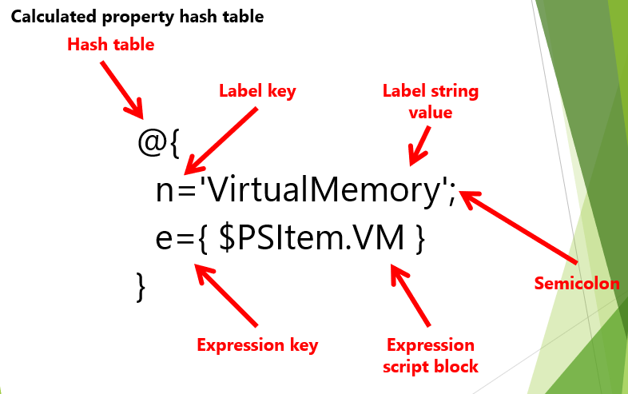
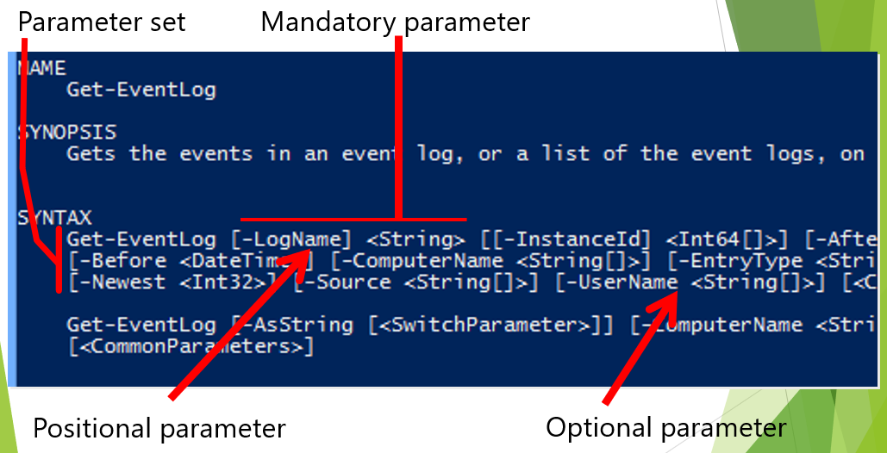

# Powershell kommentoja 

special kommentoja josta voidaan luoda scripttauksia algroitmiä, objectia, parametriä, filteröintiä ja yms

* [lisää harjoituksia](#lisää-harjoituksia)
* [cmdlet struktuurit](#cmdlet-struktuurit)
* [tarkista powershell](#tarkista-powershell)
* [parametrit](#parametrit)
* [modules](#modules)
* [Alias](#Alias)
* [Pipeline](#Pipeline)

## lisää harjoituksia

https://learn.microsoft.com/en-us/training/browse/

https://learn.microsoft.com/en-us/training/browse/?terms=powershell

## cmdlet struktuurit

Verbit: get, set, new, add, remove
noun eli substantiivit: service, process

## tarkista powershell

Jos tulee pyörittelee powershell komentopohjaa microsoft:in kanssa, niin pitää tarkistaa asetuksista, että se sallii sen integraatio yhteyden ja tukee komentoa. Eli kun käyttää powershell (admin) tai ihan perus tavallista powershell pohjaa on ok, mutta $import module microsoft kanssa tulee ongelmia niin pitää tarkistaa onko ladattu tietyä paketti tiedostoa, jotta työasema tukee microsoftin kanssa. Ehkä saattuu tulla toistuvia ongelmia, että microsoft omista sivustoilta löytyy mitä pitää ladata vielä. 

Esim.  

     "Import-Module : File C:\ProgramFiles\WindowsPowerShell\Modules\ExchangeOnlineManagement\3.1.0\netFramework\ExchangeOnlineManagement.psm1 cannot be loaded because running scripts is disabled on this system. For more information, see about_Execution_Policies at https:/go.microsoft.com/fwlink/?LinkID=135170.
     At line:1 char:1

    + Import-Module ExchangeOnlineManagement
    + CategoryInfo          : SecurityError: (:) [Import-Module], PSSecurityException   
    + FullyQualifiedErrorId : UnauthorizedAccess,Microsoft.PowerShell.Commands.ImportModuleCommand   

Mikäli jotakin puuttuu jotakin niin suorita powershell policy asetukset/oikeudet. HUOM. kantsii kopsata sitä virhe ilmoitusta ja liittää google haku kenttään, koska tässä <b>readme</b> ei ole ihan kaikkea ja ei vältämättä just ole oikea vastaus..  
https://learn.microsoft.com/en-us/powershell/module/microsoft.powershell.core/about/about_execution_policies?view=powershell-7.3 

     PS C:\Windows\system32> Set-ExecutionPolicy Unrestricted  
     Execution Policy Change
     The execution policy helps protect you from scripts that you do not trust. Changing the execution policy might expose you to the security risks described in the about_Execution_Policies help topic at
     https:/go.microsoft.com/fwlink/?LinkID=135170. Do you want to change the execution policy?
     [Y] Yes  [A] Yes to All  [N] No  [L] No to All  [S] Suspend  [?] Help (default is "N"): Yes
    PS C:\Windows\system32> Import-Module ExchangeOnlineManagement  

## parametrit

on lisättävä paremetrit ja on jokin arvo

paremetrit määrittää toimintaa command:itlle, mihin object ominaisuus kohdistuu esim. set ad user ja jne. voi olla filtterit ja joku parametrit ja tekee jotakin esim. järjestää uudestaan sort obnject ja sille annettaan parametri ja yksittäinen attribuutti aakkosjärjestyksessä (nouseva tai laskevat)

parametriä voi sijoittaa arvoja, ja eroteltuna pilkkuna - computer names muuttujaan viedään asoita (huono esim.) 

joskus parametri nimi on valinnainen position parameter, esim. get-service BITS << palvelunimi, riittää kun arvo laitettaan oikeaan paikkaan
get-serivce -name BITS (selkeä lukuseksi, mutta sama kuin ylempi, BITS = background intelligent transfer service). position parametri 

Get-help on ominaisuuksia ja synktasia, kun on kulma sulku <string> pakolinen ja hakasulku [valinnainen] 

esim:
Get-Service -Name winrm, netlogon
Get-help About*
Get-help about_TestDrive

Parametrin tunnistaa edeltävien yhdysmerkkin viiva (-), joka viittaa seuraavaksi parametrin nimi. Nimestä ja arvosta voidaan erottaa välilyönnin tai kaksoispisteellä. Jotkut parametrit eivät vaadi tai hyväksy pamaetrin arvoa, mutta muut parametrit vaativat arvon, mutta eivät vaadi parametrin nimeän  komennossa.

## modules

Moduuli on paketti, joka sisältää PowerShell-jäseniä, kuten cmdlettejä, palveluntarjoajia, toimintoja, työnkulkuja, muuttujia ja aliaksia.

Toimii  powershell versio 3:sta tai sitä uudempaa versioon & Toimitetaan osana eri ohjelmistopakettien hallintatyökaluja

wildcard characters tarkoittaa tähteä * ja suomeks. jokerimerkki, powershell ympäristössä se tarkoittaa komentojen olevian etsimistä, ei käyttöä ja eivät tuo mitään moduuleja esim. nämä alemmat kaksi komennot ovat samoja

PS C:\WINDOWS\system32> Get-Module

## Alias

Tarkoittaa powershell toiminnan lyhenteitä esim. dir = direction

PS C:\WINDOWS\system32> Get-Alias "Dir"

CommandType     Name                                               Version    Source
-----------     ----                                               -------    ------
Alias           dir -> Get-ChildItem

Syöttämällä komennon niin periaatteessa sama methodi toimii molemmissa termeinä esim.  $dir tai $Get-ChildItem - että molemmat toistaa hakemiston, myös voidaan luoda oma alias lyhenne toiminta. myös muita esim. $cls tai $clear puhdistaa koko powershell komentorivin

jos haluaa luoda oman uuden komennon menisi alemman mukaan, eli Demo tilalle luoo oman haluamansa lyhenteen:
New-Alias –name “Demo” Get-ChildItem

ainii myös kun käynissä oleva powershell admin istunnon se uusi komennon alias tapahtuu vain kerran, ettei sitä voi käyttää jatkuvasti sitä samaa, koska muuten tulisi tekee powershel ISE scriptauksessa (jotenkin jännästi)

## Pipeline

Kommenossa se tarkoittaisi | (putki)

komento lyödään powershell, sillo ollaan Pipeline kuvitteelinen putki, joka kuvaa kommenon suoritusta. putken vasemsta sorvutaan objekteja sisään ja putken oikeast pätkästä muokattuja (ei aina). 
useampi kommenotja objektejä mm. filteröinti, muokkausta, mittaamisesta, sorttausta, laskemista ja yms. voidaan tuottaa näkymä näillä format komennolla. periaatteessa tapahtuu putken sisällä.

listatat jokeri merkkejä get up computer vs muuta, varsinaiset filtterit where object kommennon käyttö ja basic malli. 
enumerating viittaa prosessiin haettaan jostakin, yksikerralaan muokkataan niitä ja ei voi tehd yhtä aikaan esim. muokata joidenkin koneiden ominaisuuksia.  haetaan koneet muuttujaan ja sen jälkeen joudutaan yksittelen tekemään muutosta. 
koska komennossa siellä on parameter computer name, ja sitä nimi voi vaa yhden objektin. jolloin luetaan yksi kerrallaan, for each silmukassa käsitteelee yksittelen ja taas seuraava.

## kommenti
jos on pitkä kommentti vaikappa pitkä runoilu, mitä tähän scripttiin tulee olemaankaan, ja esim. muistiinpanona tai tämä yksittäinen/pitkä funktio/parametri mitä se tarkoittakaan

<#
asdfasdfsdgj
asdfsdf
#>
