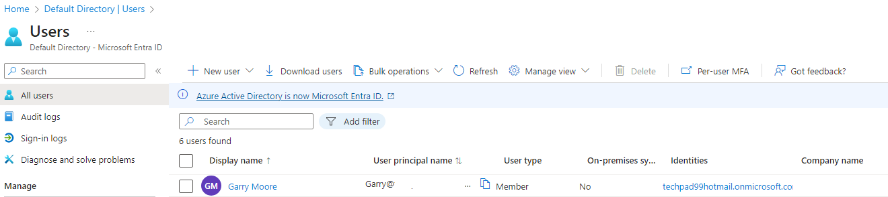
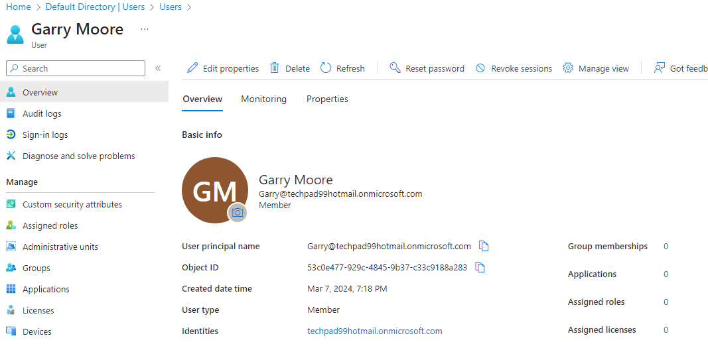

# create new user
this guide can find out at learn.microsoft, just small quick practice at vscode powershell terminal (normal powershell terminal is also good choice)

https://learn.microsoft.com/en-us/powershell/azure/active-directory/new-user-sample?view=azureadps-2.0

`UserProfile = New-Object -TypeName Microsoft.Open.AzureAD.Model.PasswordProfile`                                                                                
`$UserProfile.Password = <"thePassword">`

`$New-AzureADUser -AccountEnabled $True -DisplayName "Garry Moore" -PasswordProfile $UserProfile -MailNickName "GarryM" -UserPrincipalName <MailNickName>@<directory name>.com`

ObjectId                             DisplayName UserPrincipalName                      UserType
--------                             ----------- -----------------                      --------
51a2173e-7d50-4bec-a6eb-b9011d45bcef Garry Moore Garry@domain.onmicrosoft.com           Member

