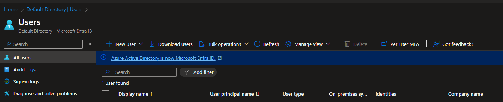
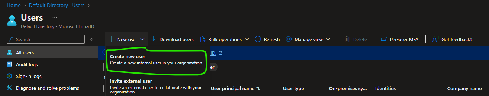
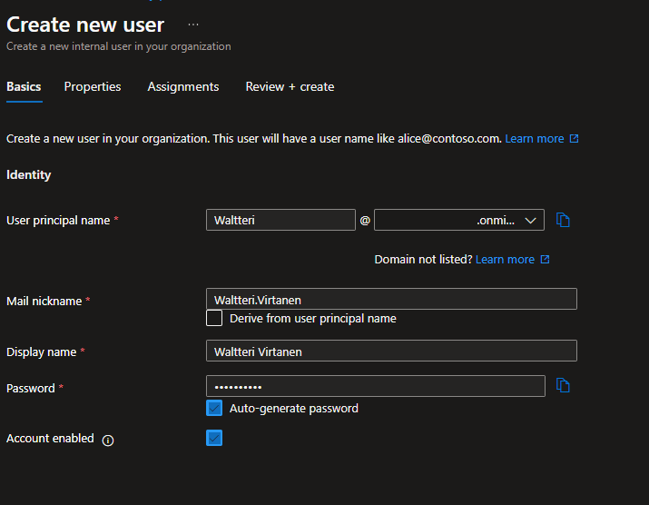
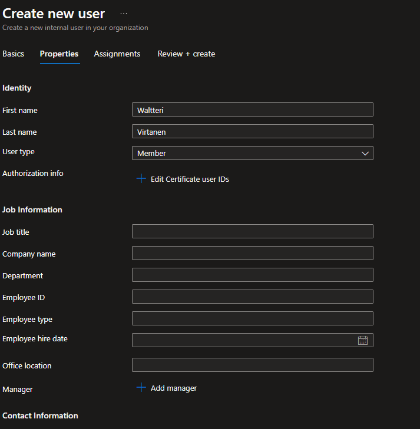
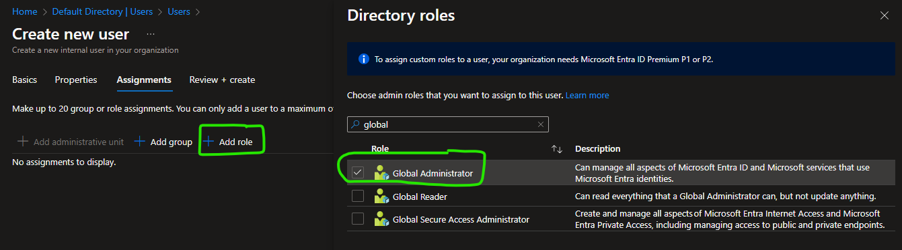
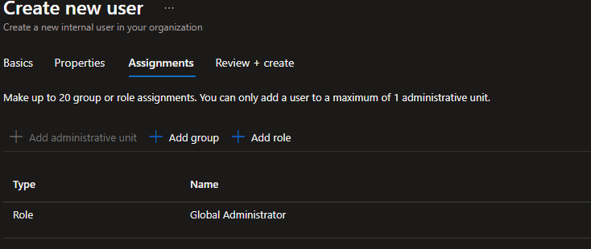
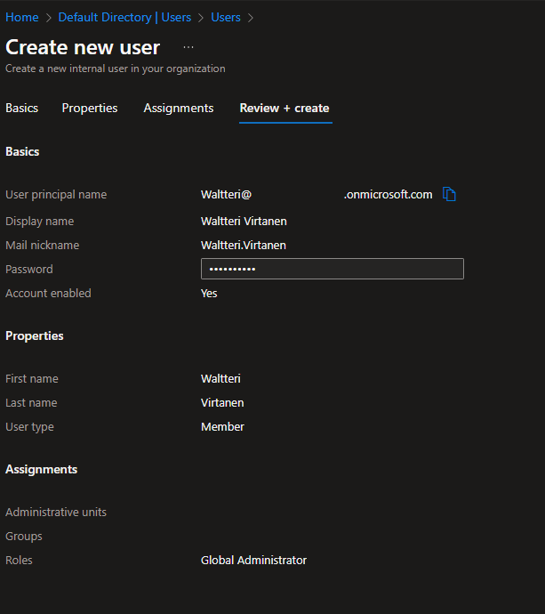
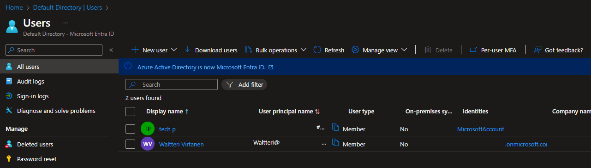
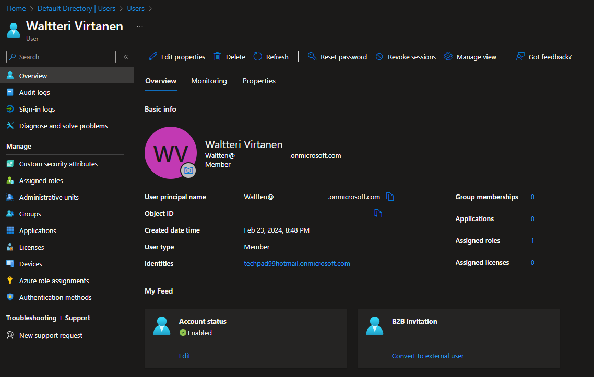

# Page View 

Just normal page view, how it looks like normally (as created and loged inside)

  * [add user](#add-user)
    * [check the user](#check-the-user)

## add user

Just example add another user, as create account and give a permissions role level

After created account, it will added to list (all users), if does not first come (REFRESH) the list just in case, but be patiences.

### check the user

Small warning this user (just normal admin level) DO NOT have any Microsoft licenses

